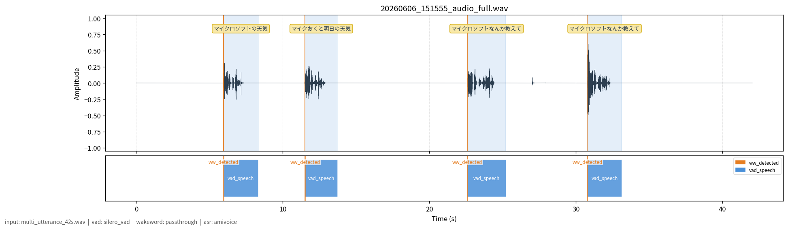

# susumu_asr

> [!WARNING]
> **注意：このリポジトリは生成AIで適当に作ってます。**

VAD (音声区間検出)、ウェイクワード検出、ASR (音声認識) を組み合わせて、ROS2上で動作させるパッケージです。



---

## 特徴

### 複数の ASR エンジンに対応

用途やコストに合わせて音声認識エンジンを選択できます。

| エンジン | プラグイン名 | 特徴 |
|----------|-------------|------|
| Google Cloud Speech-to-Text | `google_cloud` | ストリーミング認識。高精度なクラウド認識 |
| faster-whisper | `whisper` | ローカル推論。オフライン環境や GPU 活用に |
| AmiVoice ACP | `amivoice` | WebSocket ストリーミング。日本語特化の高精度認識 |

### SileroVAD による音声区間検出

[Silero VAD](https://github.com/snakers4/silero-vad) を使用して発話区間を自動検出します。無音区間を除いた音声だけを ASR エンジンに送ることで、誤認識を抑えながら継続的な認識を実現します。検出感度や無音判定時間はパラメータで調整できます。

### ウェイクワード検出

ウェイクワードを検出してから ASR を起動する構成に対応しています。常時認識（`passthrough`）のほか、[livekit-wakeword](https://github.com/livekit/livekit-wakeword) や [OpenWakeWord](https://github.com/dscripka/openWakeWord) を組み合わせることができます。

### デバッグ機能

`debug=True` で起動すると `./debug/` ディレクトリに以下のファイルを出力します。音声がどの区間で発話として検出され、それぞれの区間で何が認識されたかを事後確認できます。

| 出力ファイル | 内容 |
|-------------|------|
| `*_waveform.png` | 波形と VAD 検出区間を重ねた画像（上の画像はこの出力例） |
| `*_audio_full.wav` | セッション全体の録音 |
| `speech_*.wav` | 発話区間ごとに切り出した音声 |
| `*_label.txt` | 各区間の開始・終了時刻とラベル（タブ区切り） |
| `*_log.txt` | 認識結果を含む全ログ |

---

## インストール & ビルド手順

本パッケージは [ROS 2](https://docs.ros.org/en) のワークスペース (例: `ros2_ws/src/`) に配置し、依存をインストールしてからビルドします。

### 1. ワークスペースに配置

```bash
cd ~/ros2_ws/src
git clone https://github.com/sato-susumu/susumu_asr.git
```

### 2. 依存パッケージのインストール

手動でインストールする場合:

```bash
pip install pyaudio torch torchaudio google-cloud-speech faster-whisper click "numpy<2.0" python-dotenv
```

### 3. 環境変数の設定

APIキーなどの秘密情報は `.env` ファイルで管理します。

```bash
cp .env.sample .env
```

`.env` を開き、使用する ASR プラグインに応じて値を設定してください。

| 変数名 | 必要なプラグイン | 内容 |
|--------|-----------------|------|
| `GOOGLE_APPLICATION_CREDENTIALS` | `google_cloud` | Google Cloud 認証情報 JSON のパス |
| `AMIVOICE_APP_KEY` | `amivoice` | AmiVoice ACP アプリケーションキー |

> `.env` は `.gitignore` および `.claudeignore` に登録済みのため、Git コミットや Claude Code へのコンテキスト送信の対象外です。

### 4. ビルド

```bash
cd ~/ros2_ws
colcon build
source install/setup.bash
```

---

## 出力トピック

| トピック | 型 | 内容 |
|----------|----|------|
| `/stt_event` | `std_msgs/String` | JSON形式の全イベント（VAD・ウェイクワード・ASR由来） |
| `/stt` | `std_msgs/String` | 音声認識完了時の認識テキストのみ |

---

## `/stt_event` トピックのイベント一覧

`/stt_event` は全イベントを JSON で配信する。`event_type` フィールドで種別を識別する。

| `event_type` | 由来 | 主なフィールド |
|---|---|---|
| `vad_speech_start` | VAD | `start`, `score`（ウェイクワードスコア。非対応プラグインは 0.0） |
| `vad_speech_stop` | VAD | `start`, `end` |
| `asr_partial_result` | ASR | `start`, `text` |
| `asr_final_result` | ASR | `start`, `end`, `text` |

---

## launchファイルから起動

### SileroVAD＋google音声認識

```bash
ros2 launch susumu_asr google.launch.py
```

### SileroVAD＋whisper音声認識

```bash
ros2 launch susumu_asr whisper.launch.py
```

### SileroVAD＋AmiVoice音声認識

```bash
ros2 launch susumu_asr amivoice.launch.py
```

### デバッグモード（ログ・波形・セッション音声を出力）

```bash
ros2 launch susumu_asr google_debug.launch.py
ros2 launch susumu_asr whisper_debug.launch.py
ros2 launch susumu_asr amivoice_debug.launch.py
```

### WAVファイル入力デバッグ

```bash
ros2 launch susumu_asr google_debug_wav.launch.py
ros2 launch susumu_asr whisper_debug_wav.launch.py
ros2 launch susumu_asr amivoice_debug_wav.launch.py
```

---

## ノード起動時のパラメータ

| パラメータ名                            | 型      | 既定値                       | 説明                                                        |
|-----------------------------------------|---------|------------------------------|-------------------------------------------------------------|
| `list_mic_devices`                      | bool    | `False`                      | `True` にすると起動時にマイクデバイス一覧を表示             |
| `vad_plugin`                            | string  | `"silero_vad"`               | VAD プラグイン名（現在は `silero_vad` のみ）                |
| `wakeword_plugin`                       | string  | `"passthrough"`              | `passthrough` / `livekit_wakeword` / `openwakeword`         |
| `asr_plugin`                            | string  | `"google_cloud"`             | `google_cloud` / `whisper` / `amivoice`                     |
| `input_device_index`                    | int     | `-1`                         | マイク入力のデバイスインデックス（-1 でシステムデフォルト） |
| `input_file`                            | string  | `""`                         | WAV ファイルのパスを指定するとファイル入力に切り替わる      |
| `simulate_realtime`                     | bool    | `True`                       | WAV ファイル入力時にリアルタイムを模倣して遅延を挿入する    |
| `debug`                                 | bool    | `False`                      | 全音声 WAV 出力 & VAD ラベル出力を有効化                    |
| `silero_vad.threshold`                  | float   | `0.5`                        | VAD 検出しきい値（0.0〜1.0）                                |
| `silero_vad.silence_threshold_ms`       | int     | `2000`                       | 発話終了とみなす無音時間 (ms)                               |
| `silero_vad.pre_speech_ms`              | int     | `300`                        | 発話開始時に遡って送るバッファ時間 (ms)                     |
| `silero_vad.speech_pad_ms`              | int     | `30`                         | 発話開始・終了タイムスタンプに付加するパディング (ms)       |
| `livekit_wakeword.model_name`           | string  | `"hey_mycroft_v0.1.onnx"`    | livekit-wakeword の ONNX モデルファイル名                   |
| `livekit_wakeword.model_folder`         | string  | `"models"`                   | モデルファイルが置かれたディレクトリ                        |
| `livekit_wakeword.threshold`            | float   | `0.5`                        | ウェイクワード検出しきい値（0.0〜1.0）                      |
| `google_cloud.language_code`            | string  | `"ja-JP"`                    | Google Cloud Speech-to-Text の言語コード                    |
| `whisper.model_name`                    | string  | `"large-v2"`                 | faster-whisper モデル名                                     |
| `whisper.language_code`                 | string  | `"auto"`                     | Whisper 言語コード（`auto` で自動判別）                     |
| `whisper.device`                        | string  | `"auto"`                     | 推論デバイス（`auto` / `cpu` / `cuda`）                     |
| `amivoice.engine`                       | string  | `"-a-general"`               | AmiVoice ACP 認識エンジン名                                 |
| `amivoice.profile_words`                | string  | `""`                         | ユーザー辞書（`表記 読み` 形式、複数は `\|` 区切り）         |

### パラメータ指定例

Google Cloud ASR で起動する場合:

```bash
ros2 run susumu_asr susumu_asr_node \
  --ros-args \
    -p asr_plugin:=google_cloud
```

AmiVoice ASR でユーザー辞書を指定する場合:

```bash
ros2 run susumu_asr susumu_asr_node \
  --ros-args \
    -p asr_plugin:=amivoice \
    -p amivoice.profile_words:="ヘイマイクロフト へいまいくろふと"
```

WAVファイルから入力する（リアルタイムシミュレーションはデフォルトで ON）:

```bash
ros2 run susumu_asr susumu_asr_node \
  --ros-args \
    -p input_file:="path/to/sample.wav"
```

---

## 使用ライブラリ

- **VAD (Voice Activity Detection)**
  - [Silero VAD](https://github.com/snakers4/silero-vad)
- **ウェイクワード検出**
  - [livekit-wakeword](https://github.com/livekit/livekit-wakeword)
- **ASR (Automatic Speech Recognition)**
  - [Google Cloud Speech-to-Text](https://cloud.google.com/speech-to-text)
  - [faster-whisper](https://github.com/SYSTRAN/faster-whisper)
  - [AmiVoice ACP](https://acp.amivoice.com/)
