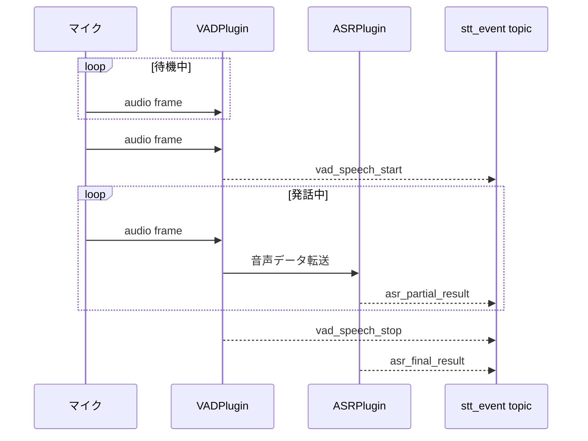

# susumu_asr_ros
VAD (音声区間検出)、ウェイクワード検出、ASR (音声認識) を組み合わせて、ROS2上で動作させるパッケージです。

---

## 概要

- **VAD (Voice Activity Detection)**  
  - [Silero VAD](https://github.com/snakers4/silero-vad)  
- **ウェイクワード検出**
  - [livekit-wakeword](https://github.com/livekit/livekit-wakeword)  
- **ASR (Automatic Speech Recognition)**  
  - [Google Cloud Speech-to-Text](https://cloud.google.com/speech-to-text)  
  - [faster-whisper](https://github.com/SYSTRAN/faster-whisper)

---

## インストール & ビルド手順

本パッケージは [ROS 2](https://docs.ros.org/en) のワークスペース (例: `ros2_ws/src/`) に配置し、依存をインストールしてからビルドします。

### 1. ワークスペースに配置

```bash
cd ~/ros2_ws/src
git clone https://github.com/sato-susumu/susumu_asr_ros.git
```

### 2. 依存パッケージのインストール

手動でインストールする場合:

```bash
# 例: Python仮想環境下で
pip install pyaudio torch torchaudio google-cloud-speech faster-whisper click "numpy<2.0"
pip install livekit-wakeword --ignore-requires-python
```

### 3. ビルド

```bash
cd ~/ros2_ws
colcon build
source install/setup.bash
```

---

## システム概要



---

## `/stt_event` トピックのイベント一覧

`/stt_event` は全イベントを JSON で配信する。`event_type` フィールドで種別を識別する。

| `event_type` | 由来 | 主なフィールド |
|---|---|---|
| `vad_speech_start` | VAD | `start`, `score`（ウェイクワードスコア。非対応プラグインは 0.0） |
| `vad_speech_stop` | VAD | `start`, `end` |
| `asr_partial_result` | ASR | `start`, `text` |
| `asr_final_result` | ASR | `start`, `end`, `text` |
| `asr_timeout` | ASR | `start`, `end`, `reason` |

---

## launchファイルから起動

### livekit-wakeword＋google音声認識

```bash
ros2 launch susumu_asr_ros livekit_wakeword_google.launch.py
```

### livekit-wakeword＋whisper音声認識

```bash
ros2 launch susumu_asr_ros livekit_wakeword_whisper.launch.py
```

### SileroVAD＋google音声認識

```bash
ros2 launch susumu_asr_ros silerovad_google.launch.py
```

### SileroVAD＋whisper音声認識

```bash
ros2 launch susumu_asr_ros silerovad_whisper.launch.py
```

### ノード単体で起動

```bash
ros2 run susumu_asr_ros susumu_asr_node
```

（パラメータを指定する方法は後述）

---

## パラメータによるカスタマイズ

`susumu_asr_node.py` では、ROS 2 のパラメータを使って以下の項目を切り替えられます。

| パラメータ名                        | 型      | 既定値                       | 説明                                                        |
|-------------------------------------|---------|------------------------------|-------------------------------------------------------------|
| `list_mic_devices`                  | bool    | `False`                      | `True` にすると起動時にマイクデバイス一覧を表示             |
| `vad_plugin`                        | string  | `"silero_vad"`               | `silero_vad` / `livekit_wakeword`                           |
| `asr_plugin`                        | string  | `"google_cloud"`             | `google_cloud` or `whisper`                                 |
| `input_device_index`                | int     | `-1`                         | マイク入力のデバイスインデックス（-1 でシステムデフォルト） |
| `input_file`                        | string  | `""`                         | WAV ファイルのパスを指定するとファイル入力に切り替わる      |
| `simulate_realtime`                 | bool    | `False`                      | WAV ファイル入力時にリアルタイムを模倣して遅延を挿入する    |
| `debug`                             | bool    | `False`                      | 全音声 WAV 出力 & VAD ラベル出力を有効化                    |
| `livekit_wakeword.model_name`       | string  | `"hey_mycroft_v0.1.onnx"`    | livekit-wakeword の ONNX モデルファイル名                   |
| `livekit_wakeword.model_folder`     | string  | `"models"`                   | モデルファイルが置かれたディレクトリ                        |
| `livekit_wakeword.threshold`        | float   | `0.5`                        | ウェイクワード検出しきい値（0.0〜1.0）                      |
| `google_cloud.language_code`        | string  | `"ja-JP"`                    | Google Cloud Speech-to-Text の言語コード                    |
| `whisper.model_name`                | string  | `"large-v2"`                 | faster-whisper モデル名                                     |
| `whisper.language_code`             | string  | `"ja"`                       | Whisper 言語コード（`auto` で自動判別）                     |
| `whisper.device`                    | string  | `"auto"`                     | 推論デバイス（`auto` / `cpu` / `cuda`）                     |

### パラメータ指定例

VAD を SileroVAD、ASR を Google Cloud にする場合:

```bash
ros2 run susumu_asr_ros susumu_asr_node \
  --ros-args \
    -p vad_plugin:=silero_vad \
    -p asr_plugin:=google_cloud
```

WAVファイルから入力し、リアルタイムシミュレーションを ON にする:

```bash
ros2 run susumu_asr_ros susumu_asr_node \
  --ros-args \
    -p input_file:="path/to/sample.wav" \
    -p simulate_realtime:=True
```
