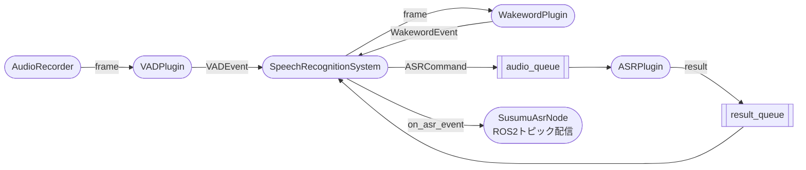
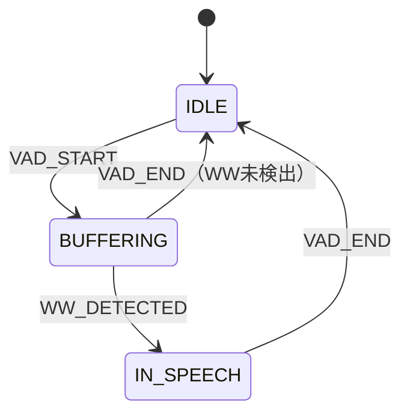
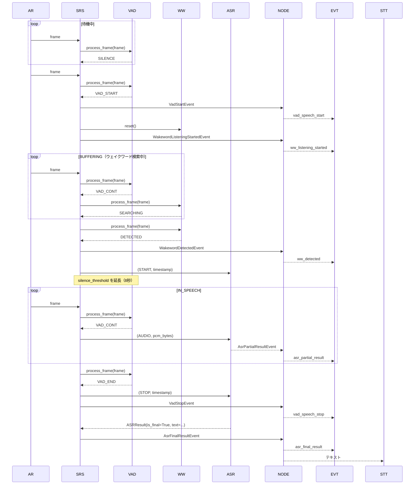
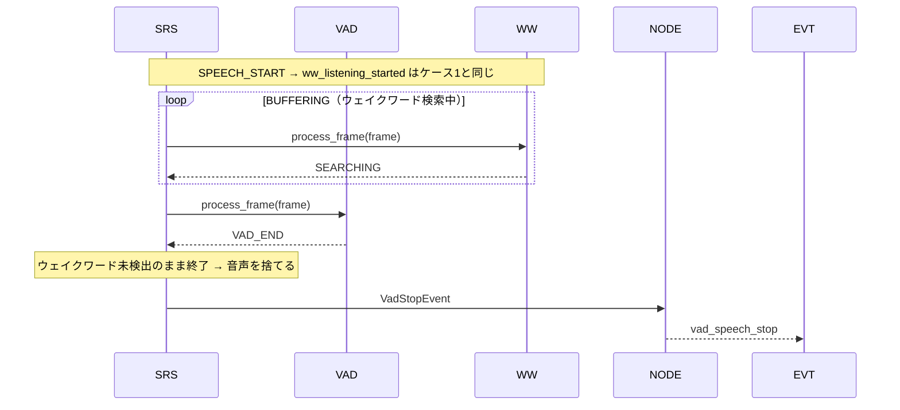
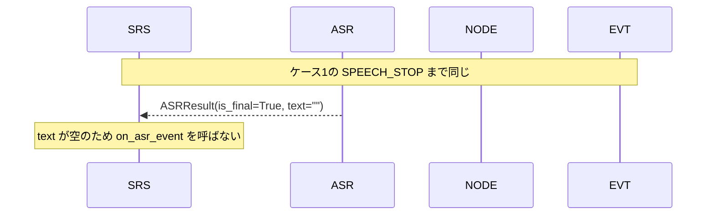
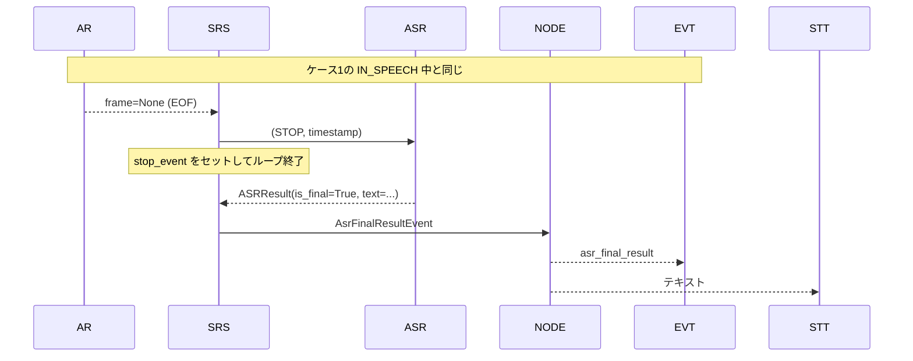
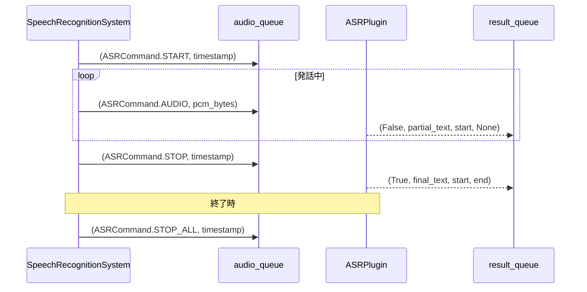
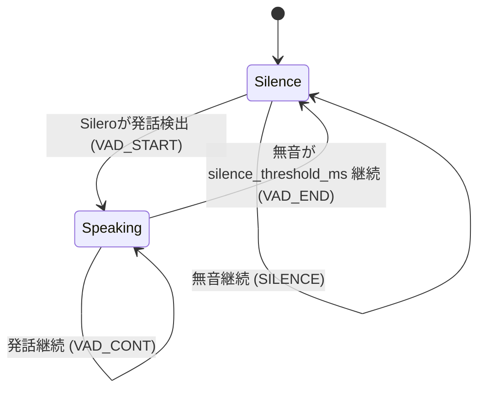
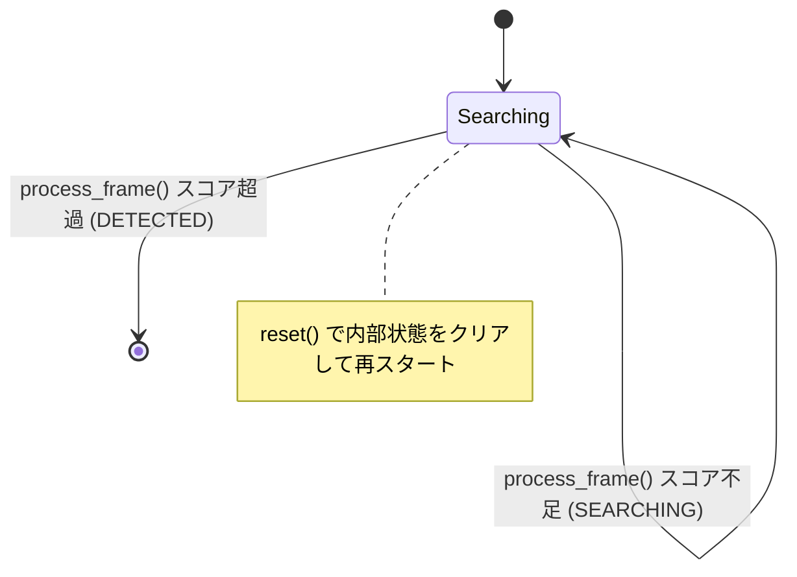
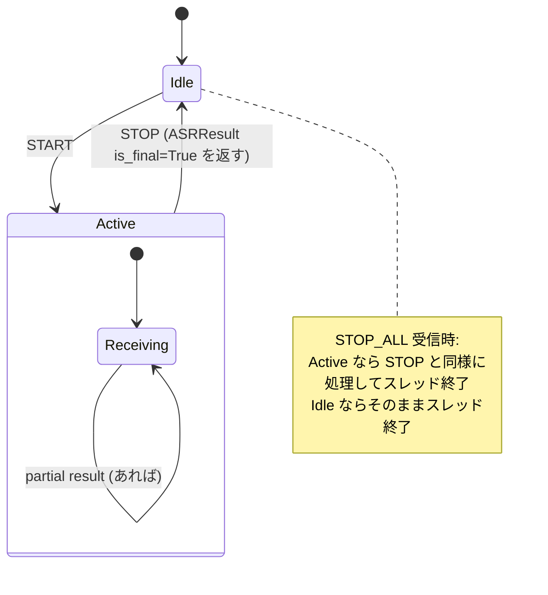

# モジュール責務一覧

## 目次

- [パイプライン概要](#パイプライン概要)
- [定数・基盤](#定数基盤)
  - [constants.py](#constantspy)
  - [plugin_base.py](#plugin_basepy)
  - [plugin_loader.py](#plugin_loaderpy)
- [プラグイン共通ルール](#プラグイン共通ルール)
  - [ライフサイクル](#ライフサイクル)
  - [パラメータ宣言](#パラメータ宣言)
  - [エントリポイント登録](#エントリポイント登録)
  - [VADプラグインのイベント仕様](#vadプラグインのイベント仕様)
  - [WakewordプラグインのイベントP仕様](#wakewordプラグインのイベント仕様)
  - [ASRプラグインのキュープロトコル](#asrプラグインのキュープロトコル)
- [VADプラグイン](#vadプラグイン)
  - [vad_silero.py](#vad_sileropy)
- [Wakewordプラグイン](#wakewordプラグイン)
  - [wakeword_passthrough.py](#wakeword_passthroughpy)
  - [wakeword_livekit.py](#wakeword_livekitpy)
  - [wakeword_openwakeword.py](#wakeword_openwakewordpy)
- [ASRプラグイン](#asrプラグイン)
  - [asr_google.py](#asr_googlepy)
  - [asr_whisper.py](#asr_whisperpy)
- [音声入出力](#音声入出力)
  - [audio_io.py](#audio_iopy)
- [パイプライン制御](#パイプライン制御)
  - [susumu_asr.py](#susumu_asrpy)
  - [SpeechRecognitionSystem コールバックプロトコル](#speechrecognitionsystem-コールバックプロトコル)
- [ROS2ノード](#ros2ノード)
  - [susumu_asr_node.py](#susumu_asr_nodepy)

---

## パイプライン概要



### SpeechRecognitionSystem の状態機械



| 遷移 | トリガー | 処理 |
|---|---|---|
| IDLE → BUFFERING | `VADEvent.VAD_START` | `vad_speech_start` / `ww_listening_started` 発行、WakewordPlugin に `reset()`、音声をバッファに蓄積開始 |
| BUFFERING → IN_SPEECH | `WakewordEvent.DETECTED` | `ww_detected` 発行、VAD の無音閾値を延長（8秒）、バッファ先頭から ASR に送信開始 |
| BUFFERING → IDLE | `VADEvent.VAD_END`（WW未検出） | 音声を捨てる、`vad_speech_stop` 発行 |
| IN_SPEECH → IDLE | `VADEvent.VAD_END` | ASR に STOP 送信、`vad_speech_stop` 発行 |

以下のシーケンスで共通する participant は省略表記を統一する。

| 省略名 | 実体 |
|---|---|
| AR | AudioRecorder |
| SRS | SpeechRecognitionSystem |
| VAD | VADPlugin |
| WW | WakewordPlugin |
| ASR | ASRPlugin |
| NODE | SusumuAsrNode |
| EVT | stt_event topic |
| STT | stt topic |

#### ケース1: 正常系（ウェイクワード検出 → ASR認識完了）



#### ケース2: ウェイクワード未検出（発話はあったが認識しなかった）

VAD が発話を検出したが、`SPEECH_STOP` までにウェイクワードが見つからなかった場合。音声は捨てられ ASR には渡らない。



#### ケース3: ASR が空文字を返す（認識結果なし）



#### ケース4: WAVファイル終端で発話セッションを強制終了



---

## 定数・基盤

### `constants.py`
パイプライン全体で共有する定数を定義する。他モジュールはここからimportし、直接マジックナンバーを書かない。

| 定数 | 値 | 意味 |
|---|---|---|
| `SAMPLE_RATE` | `16000` | サンプリングレート (Hz) |
| `SAMPLE_WIDTH` | `2` | サンプル幅 (bytes) |
| `CHANNELS` | `1` | チャンネル数 |
| `FRAME_LENGTH_MS` | `30` | 1フレームの長さ (ms) |
| `AUDIO_FRAME_SAMPLES` | `512` | AudioRecorder フレームサイズ / Silero VAD 最小サンプル数 |
| `INT16_MAX` | `32768.0` | int16 PCM を -1.0〜1.0 に正規化する係数（2^15） |
| `MS_PER_SEC` | `1000.0` | ms を秒に変換する係数 |
| `VAD_SILERO_VAD` | `"silero_vad"` | VADプラグイン識別名 |
| `VAD_LIVEKIT_WAKEWORD` | `"livekit_wakeword"` | Wakewordプラグイン識別名 |
| `VAD_OPENWAKEWORD` | `"openwakeword"` | Wakewordプラグイン識別名 |
| `ASR_GOOGLE_CLOUD` | `"google_cloud"` | ASRプラグイン識別名 |
| `ASR_WHISPER` | `"whisper"` | ASRプラグイン識別名 |

### `plugin_base.py`
プラグインのインタフェース・列挙型・パラメータ宣言型を定義する。

| クラス/型 | 責務 |
|---|---|
| `VADEvent` | `VADPlugin.process_frame()` が返すイベント名の列挙型（`SILENCE` / `VAD_START` / `VAD_CONT` / `VAD_END`） |
| `WakewordEvent` | `WakewordPlugin.process_frame()` が返すイベント名の列挙型（`SEARCHING` / `DETECTED`） |
| `ASRCommand` | `audio_queue` に送るコマンド名の列挙型 |
| `ASREventType` | `on_asr_event` コールバックのイベント種別の列挙型 |
| `SRSState` | `SpeechRecognitionSystem` の内部状態の列挙型（`IDLE` / `BUFFERING` / `IN_SPEECH`） |
| `VADResult` | `VADPlugin.process_frame()` の戻り値（`event: VADEvent`, `frames: list[bytes]`） |
| `WakewordResult` | `WakewordPlugin.process_frame()` の戻り値（`event: WakewordEvent`, `score: float`） |
| `ASRResult` | `result_queue` から返る認識結果（`is_final`, `text`, `start`, `end`） |
| `VadStartEvent` | VAD 発話開始イベント（`start`） |
| `VadStopEvent` | VAD 発話終了イベント（`start`, `end`） |
| `WakewordListeningStartedEvent` | ウェイクワード検出処理開始イベント（`start`） |
| `WakewordDetectedEvent` | ウェイクワード検出確定イベント（`start`, `score`） |
| `AsrPartialResultEvent` | ASR 途中認識結果イベント（`start`, `text`） |
| `AsrFinalResultEvent` | ASR 確定認識結果イベント（`start`, `end`, `text`） |
| `PluginParam` | プラグインが宣言するパラメータ1件（名前・デフォルト値・説明）を保持するデータクラス |
| `ASRPluginBase` | ASRプラグインの抽象基底クラス。`extend_silence_on_wakeword` フラグ（デフォルト `True`）でウェイクワード検出後の無音閾値延長の要否を宣言する |
| `VADPluginBase` | VADプラグインの抽象基底クラス。`extend_silence_threshold()` でウェイクワード検出後に無音閾値を延長できる |
| `WakewordPluginBase` | Wakewordプラグインの抽象基底クラス。`process_frame()` と `reset()` を定義。`extend_silence_on_detected` フラグ（デフォルト `True`）で無音閾値延長の要否を宣言する |

### `plugin_loader.py`
`PluginLoader` クラスがPythonエントリポイント（`importlib.metadata`）を使い、プラグイン名からクラスを動的にロードする。`setup.py` に登録されたプラグインのみ発見対象となるため、サードパーティが独自プラグインを追加する際も本体コードの変更は不要。

| メソッド | 責務 |
|---|---|
| `PluginLoader.load_asr(name)` | 名前で ASR プラグインクラスを返す |
| `PluginLoader.load_vad(name)` | 名前で VAD プラグインクラスを返す |
| `PluginLoader.load_wakeword(name)` | 名前で Wakeword プラグインクラスを返す |
| `PluginLoader.list_asr_plugins()` | 登録済み ASR プラグイン名一覧を返す |
| `PluginLoader.list_vad_plugins()` | 登録済み VAD プラグイン名一覧を返す |
| `PluginLoader.list_wakeword_plugins()` | 登録済み Wakeword プラグイン名一覧を返す |

---

## プラグイン共通ルール

### ライフサイクル

プラグインは以下の順序でメソッドが呼ばれる。

```
__init__()  →  load_params()  →  setup()  →  run() / process_frame() / reset()
```

- `__init__()` では重い処理（モデルロード等）を行わない
- `load_params()` でパラメータ値を受け取り、インスタンス変数に保存する
- モデルロード等の重い初期化は `setup()` で行う
- ASR は `setup()` でキューも受け取り、その後 `run()` をスレッドで実行する
- VAD は `setup()` 後、フレームごとに `process_frame()` を呼ばれる
- Wakeword は `SPEECH_START` のたびに `reset()` を呼ばれ、その後フレームごとに `process_frame()` を呼ばれる

### パラメータ宣言

各プラグインは `get_param_declarations()` で使用するパラメータを `PluginParam` のリストとして返す。`PluginParam` には名前・デフォルト値・説明を記載する。

```python
def get_param_declarations(self) -> list[PluginParam]:
    return [
        PluginParam("param_name", default_value, "説明"),
    ]
```

ノードはこのリストをもとにROS2パラメータを `{plugin_name}.{param_name}` 形式で宣言する。`--ros-args` から上書き可能。

### エントリポイント登録

新しいプラグインは `setup.py` の対応グループにエントリポイントを追加することで利用可能になる。

```python
"susumu_asr_ros.asr_plugins": [
    "my_asr = my_package.my_asr:MyASRPlugin",
],
"susumu_asr_ros.vad_plugins": [
    "my_vad = my_package.my_vad:MyVADPlugin",
],
"susumu_asr_ros.wakeword_plugins": [
    "my_ww = my_package.my_ww:MyWakewordPlugin",
],
```

### VADプラグインのイベント仕様

`process_frame(frame: bytes)` は `VADResult(event, frames)` を返す。`in_speech` フラグを持ち、`SpeechRecognitionSystem` から参照される。ウェイクワード検出後に SRS が `extend_silence_threshold(ms)` を呼んで無音閾値を延長できる。


| VADEvent | frames の内容 |
|---|---|
| `SILENCE` | `[]`（処理不要） |
| `VAD_START` | 発話開始前のバッファ＋現フレーム |
| `VAD_CONT` | 現フレーム |
| `VAD_END` | 現フレーム |

### Wakewordプラグインのイベント仕様

`reset()` は SRS が `SPEECH_START` を受けるたびに呼ぶ。`process_frame(frame: bytes)` は `WakewordResult(event, score)` を返す。

| WakewordEvent | 意味 |
|---|---|
| `SEARCHING` | 検索中（まだ未検出） |
| `DETECTED` | ウェイクワード検出確定 |

DETECTED を返した後は SRS が IN_SPEECH に遷移するため、再度 `reset()` が呼ばれるまで `process_frame()` は呼ばれない。

### ASRプラグインのキュープロトコル

`audio_queue` に渡すメッセージ形式は `(ASRCommand, data: bytes)` 。`result_queue` から返すメッセージ形式は `ASRResult`（`is_final`, `text`, `start`, `end`）。`end` は partial結果では `None`。



---

## VADプラグイン

### `vad_silero.py`
Silero VAD を用いた発話区間検出プラグイン。`SilenceAwareVADIterator`（内部クラス）が Silero の `VADIterator` をラップし、無音継続時間ベースの発話終了判定を行う。512サンプル未満のフレームは `ValueError` を送出する。`extend_silence_threshold(ms)` で無音閾値を動的に変更できる。



| パラメータ | デフォルト | 説明 |
|---|---|---|
| `threshold` | `0.5` | VAD 検出しきい値 |
| `silence_threshold_ms` | `1000` | 発話終了とみなす無音時間 (ms) |
| `pre_speech_ms` | `300` | 発話開始時に遡って送るバッファ時間 (ms) |

---

## Wakewordプラグイン

全プラグイン共通の状態遷移。SRS が `VAD_START` を受けるたびに `reset()` を呼び、その後フレームごとに `process_frame()` を呼ぶ。`DETECTED` を返した後は SRS が `IN_SPEECH` に遷移するため、再度 `reset()` が呼ばれるまで `process_frame()` は呼ばれない。



**プラグイン間の差異**

| プラグイン | score の算出方法 | reset() でクリアされるもの | `extend_silence_on_detected` |
|---|---|---|---|
| `passthrough` | `delay_sec` 経過前は `0.0`、経過後は `1.0` | フレームカウント | `False`（無音閾値延長しない） |
| `livekit_wakeword` | ONNXモデルの推論スコア | リングバッファ | `True` |
| `openwakeword` | tfliteモデルの推論スコア | prediction_buffer | `True` |

### `wakeword_passthrough.py`
ウェイクワード検出をスキップするパススループラグイン。`delay_sec` 後に即 `DETECTED` を返す。`SileroVADPlugin` と組み合わせてウェイクワードなし常時認識モードで使用する。どのWakewordプラグインを使ってもイベントフローを統一するために存在する。

| パラメータ | デフォルト | 説明 |
|---|---|---|
| `delay_sec` | `0.5` | VAD_START から DETECTED を返すまでの遅延秒数 |
| `threshold` | `0.5` | ウェイクワード検出しきい値 |

### `wakeword_livekit.py`
livekit-wakeword による ONNX ウェイクワード検出プラグイン。2秒のリングバッファに音声を蓄積し 0.2秒ごとに推論する。

| パラメータ | デフォルト | 説明 |
|---|---|---|
| `model_folder` | `"models"` | モデルファイルが置かれたディレクトリ |
| `model_name` | `"hey_mycroft_v0.1.onnx"` | 使用する ONNX モデルファイル名 |
| `threshold` | `0.5` | ウェイクワード検出しきい値 |

モデルが存在しない場合は openWakeWord GitHub（v0.5.1）から自動ダウンロードされる。

### `wakeword_openwakeword.py`
OpenWakeWord による tflite ウェイクワード検出プラグイン。フレームごとにスコアを算出する。

| パラメータ | デフォルト | 説明 |
|---|---|---|
| `model_folder` | `"models"` | モデルファイルが置かれたディレクトリ |
| `model_name` | `"hey_mycroft_v0.1.tflite"` | 使用する tflite モデルファイル名 |
| `threshold` | `0.5` | ウェイクワード検出しきい値 |

---

## ASRプラグイン

全プラグイン共通の状態遷移。`run()` ループで `audio_queue` からコマンドを受け取り、`call_active` フラグでセッションを管理する。




### `asr_google.py`
Google Cloud Speech-to-Text ストリーミング認識プラグイン。`single_utterance=True` で1発話ごとにストリームを区切る。

| パラメータ | デフォルト | 説明 |
|---|---|---|
| `language_code` | `ja-JP` | 認識言語コード（例: `ja-JP`, `en-US`） |

### `asr_whisper.py`
faster-whisper によるバッチ認識プラグイン。STOP受信後に蓄積した音声をまとめてデコードする。バッチ処理のため `extend_silence_on_wakeword=False`（ウェイクワード検出後の VAD 無音閾値延長を行わない）。

| パラメータ | デフォルト | 説明 |
|---|---|---|
| `model_name` | `large-v2` | Whisper モデル名 |
| `language_code` | `auto` | 認識言語コード（`auto` / `ja` / `en` ...） |
| `device` | `auto` | 推論デバイス（`auto` / `cpu` / `cuda`） |

---

## 音声入出力

### `audio_io.py`
音声の録音（入力）とファイル書き込み（デバッグ出力）に関するクラス群をまとめる。

**録音クラス（`AudioRecorderBase` 派生）**

| クラス | 責務 |
|---|---|
| `MicAudioRecorder` | PyAudio 経由でマイクからフレームを読み取る。`list_devices()` staticmethod でデバイス一覧を表示できる |
| `WavAudioRecorder` | WAVファイルからフレームを読み取る。`simulate_realtime=True` でリアルタイム入力を模倣できる |

**音声書き込みクラス（`AudioWriterBase` 派生）**

| クラス | 責務 |
|---|---|
| `FullAudioWriter` | 全音声を1つのWAVファイルに書き出す（デバッグ用） |
| `SpeechAudioWriter` | 発話セッション単位でWAVファイルを書き出す（デバッグ用） |
| `DummyAudioWriter` | 何もしないダミー実装。デバッグ無効時に使用 |

**ラベル書き込みクラス（`LabelWriterBase` 派生）**

| クラス | 責務 |
|---|---|
| `LabelWriter` | 発話区間（開始・終了・ラベル）をタブ区切りテキストに書き出す（デバッグ用） |
| `DummyLabelWriter` | 何もしないダミー実装 |

---

## パイプライン制御

### `susumu_asr.py`
**音声認識パイプラインのメインループ。**

`SpeechRecognitionSystem` が VADPlugin・WakewordPlugin・ASRPlugin・AudioRecorder・各Writerを受け取り、以下を担う。

- AudioRecorder からフレームを読み取り VADPlugin に渡す
- `VADEvent` に応じて状態（IDLE / BUFFERING / IN_SPEECH）を遷移する
- BUFFERING 中は音声をバッファに蓄積しながら WakewordPlugin にフレームを渡す
- WAKEWORD_DETECTED 時に VAD の無音閾値を延長し、バッファ先頭から ASR に送信する
- 全イベントを `on_asr_event` コールバックで通知する

### `SpeechRecognitionSystem` コールバックプロトコル

コンストラクタに渡すコールバックの型と呼ばれるタイミング。

| コールバック | シグネチャ | 呼ばれるタイミング |
|---|---|---|
| `on_asr_event` | `(ASREventUnion) -> None` | 全イベント発生時（下記イベント型を参照） |

#### `on_asr_event` のイベント型

各イベントは `plugin_base.py` で定義された dataclass。`event_type` フィールド（`ASREventType`）でイベント種別を識別する。

| 型 | `event_type` | フィールド |
|---|---|---|
| `VadStartEvent` | `vad_speech_start` | `start: float` |
| `VadStopEvent` | `vad_speech_stop` | `start: float`, `end: float` |
| `WakewordListeningStartedEvent` | `ww_listening_started` | `start: float` |
| `WakewordDetectedEvent` | `ww_detected` | `start: float`, `score: float` |
| `AsrPartialResultEvent` | `asr_partial_result` | `start: float`, `text: str` |
| `AsrFinalResultEvent` | `asr_final_result` | `start: float`, `end: float`, `text: str` |

`SusumuAsrNode` はこれらを `dataclasses.asdict()` でシリアライズし、`/stt_event` トピックに JSON として配信する。

---

## ROS2ノード

### `susumu_asr_node.py`
**ROS2ノードのエントリポイント。**

`SusumuAsrNode` が以下を担う。

1. ROS2パラメータ `vad_plugin` / `wakeword_plugin` / `asr_plugin` でプラグインを選択する
2. `PluginLoader` でクラスをロード後、`_declare_plugin_params()` で `{plugin_name}.{param_name}` 形式のROS2パラメータを宣言・取得し、プラグインに注入する
3. デバッグ用ライター・AudioRecorder を生成して `SpeechRecognitionSystem` を組み立てる
4. 認識イベントを以下のトピックに配信する

| トピック | 型 | 内容 |
|---|---|---|
| `/stt_event` | `String` | 全イベントの JSON。`event_type` フィールドでイベント種別を識別する（詳細は上記ペイロード表を参照） |
| `/stt` | `String` | `asr_final_result` 時のテキストのみ（`text` フィールドの値） |

**プラグイン組み合わせ例**

| `vad_plugin` | `wakeword_plugin` | 用途 |
|---|---|---|
| `silero_vad` | `passthrough` | ウェイクワードなし常時認識 |
| `silero_vad` | `livekit_wakeword` | livekit-wakeword でウェイクワード検出 |
| `silero_vad` | `openwakeword` | OpenWakeWord でウェイクワード検出 |
