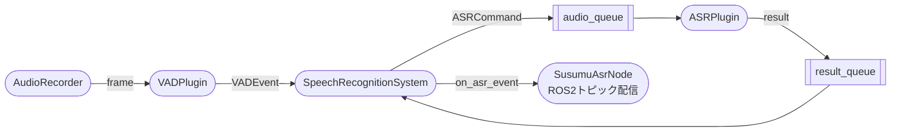
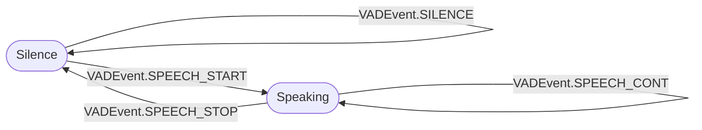
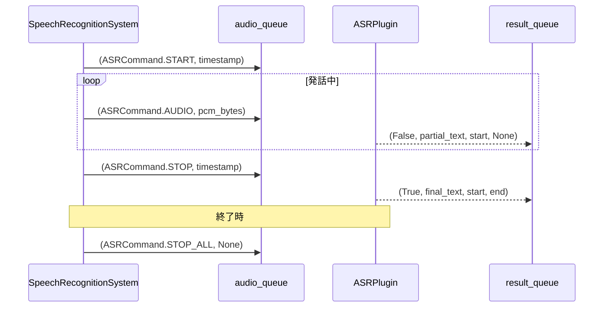

# モジュール責務一覧

## 目次

- [パイプライン概要](#パイプライン概要)
- [定数・基盤](#定数基盤)
  - [constants.py](#constantspy)
  - [plugin_base.py](#plugin_basepy)
  - [plugin_loader.py](#plugin_loaderpy)
  - [asr_base.py](#asr_basepy)
- [プラグイン共通ルール](#プラグイン共通ルール)
  - [ライフサイクル](#ライフサイクル)
  - [パラメータ宣言](#パラメータ宣言)
  - [エントリポイント登録](#エントリポイント登録)
  - [VADプラグインのイベント仕様](#vadプラグインのイベント仕様)
  - [ASRプラグインのキュープロトコル](#asrプラグインのキュープロトコル)
- [VADプラグイン](#vadプラグイン)
  - [vad_silero.py](#vad_sileropy)
  - [vad_openwakeword.py](#vad_openwakewordpy)
- [ASRプラグイン](#asrプラグイン)
  - [asr_google.py](#asr_googlepy)
  - [asr_whisper.py](#asr_whisperpy)
- [音声入出力](#音声入出力)
  - [audio_io.py](#audio_iopy)
- [パイプライン制御](#パイプライン制御)
  - [susumu_asr.py](#susumu_asrpy)
- [ROS2ノード](#ros2ノード)
  - [susumu_asr_node.py](#susumu_asr_nodepy)
  - [asr_monitor.py](#asr_monitorpy)

---

## パイプライン概要



---

## 定数・基盤

### `constants.py`
パイプライン全体で共有する定数を定義する。他モジュールはここからimportし、直接マジックナンバーを書かない。

| 定数 | 値 | 意味 |
|---|---|---|
| `SAMPLE_RATE` | `16000` | サンプリングレート (Hz) |
| `SAMPLE_WIDTH` | `2` | サンプル幅 (bytes) |
| `CHANNELS` | `1` | チャンネル数 |
| `FRAME_LENGTH_MS` | `30` | 1フレームの長さ (ms) |
| `AUDIO_FRAME_SAMPLES` | `512` | AudioRecorder フレームサイズ / Silero VAD 最小サンプル数 |
| `INT16_MAX` | `32768.0` | int16 PCM を -1.0〜1.0 に正規化する係数（2^15） |
| `MS_PER_SEC` | `1000.0` | ms を秒に変換する係数 |
| `VAD_SILERO_VAD` | `"silero_vad"` | VADプラグイン識別名 |
| `VAD_OPENWAKEWORD` | `"openwakeword"` | VADプラグイン識別名 |
| `ASR_GOOGLE_CLOUD` | `"google_cloud"` | ASRプラグイン識別名 |
| `ASR_WHISPER` | `"whisper"` | ASRプラグイン識別名 |

### `plugin_base.py`
プラグインのインタフェース・列挙型・パラメータ宣言型を定義する。

| クラス/型 | 責務 |
|---|---|
| `VADEvent` | VADプラグインが返すイベント名の列挙型（`StrEnum`） |
| `ASRCommand` | `audio_queue` に送るコマンド名の列挙型（`StrEnum`） |
| `VADResult` | `process_frame()` の戻り値（`event: VADEvent`, `frames: list`） |
| `ASRResult` | `result_queue` から返る認識結果（`is_final`, `text`, `start`, `end`） |
| `PluginParam` | プラグインが宣言するパラメータ1件（名前・デフォルト値・説明）を保持するデータクラス |
| `ASRPluginBase` | ASRプラグインの抽象基底クラス |
| `VADPluginBase` | VADプラグインの抽象基底クラス |

### `plugin_loader.py`
`PluginLoader` クラスがPythonエントリポイント（`importlib.metadata`）を使い、プラグイン名からクラスを動的にロードする。`setup.py` に登録されたプラグインのみ発見対象となるため、サードパーティが独自プラグインを追加する際も本体コードの変更は不要。

| メソッド | 責務 |
|---|---|
| `PluginLoader.load_asr(name)` | 名前で ASR プラグインクラスを返す |
| `PluginLoader.load_vad(name)` | 名前で VAD プラグインクラスを返す |
| `PluginLoader.list_asr_plugins()` | 登録済み ASR プラグイン名一覧を返す |
| `PluginLoader.list_vad_plugins()` | 登録済み VAD プラグイン名一覧を返す |

### `asr_base.py`
`ASRBase` 抽象クラスのみを定義する薄いモジュール。後方互換のために残しており、新規コードは `ASRPluginBase` を使う。

---

## プラグイン共通ルール

### ライフサイクル

プラグインは以下の順序でメソッドが呼ばれる。

```
__init__()  →  load_params()  →  setup()  →  run() / process_frame()
```

- `__init__()` では重い処理（モデルロード等）を行わない
- `load_params()` でパラメータ値を受け取り、インスタンス変数に保存する
- モデルロード等の重い初期化は `setup()` で行う
- ASR は `setup()` でキューも受け取り、その後 `run()` をスレッドで実行する
- VAD は `setup()` 後、フレームごとに `process_frame()` を呼ばれる

### パラメータ宣言

各プラグインは `get_param_declarations()` で使用するパラメータを `PluginParam` のリストとして返す。`PluginParam` には名前・デフォルト値・説明を記載する。

```python
def get_param_declarations(self) -> list[PluginParam]:
    return [
        PluginParam("param_name", default_value, "説明"),
    ]
```

ノードはこのリストをもとにROS2パラメータを `{plugin_name}.{param_name}` 形式で宣言する。`--ros-args` から上書き可能。

### エントリポイント登録

新しいプラグインは `setup.py` の対応グループにエントリポイントを追加することで利用可能になる。

```python
"susumu_asr_ros.asr_plugins": [
    "my_asr = my_package.my_asr:MyASRPlugin",
],
"susumu_asr_ros.vad_plugins": [
    "my_vad = my_package.my_vad:MyVADPlugin",
],
```

### VADプラグインのイベント仕様

`process_frame(frame: bytes)` は `(VADEvent | None, list[bytes])` のタプルを返す。`in_speech` フラグを持ち、`SpeechRecognitionSystem` から参照される。



`process_frame()` は常に `VADResult(event, frames)` を返す。

| VADEvent | frames の内容 |
|---|---|
| `SILENCE` | `[]`（処理不要） |
| `SPEECH_START` | 発話開始前のバッファ＋現フレーム |
| `SPEECH_CONT` | 現フレーム |
| `SPEECH_STOP` | 現フレーム |
| `SPEECH_TIMEOUT` | 現フレーム（タイムアウト時） |

### ASRプラグインのキュープロトコル

`audio_queue` に渡すメッセージ形式は `(ASRCommand, data: bytes)` 。`result_queue` から返すメッセージ形式は `ASRResult`（`is_final`, `text`, `start`, `end`）。`end` は partial結果では `None`。



---

## VADプラグイン

### `vad_silero.py`
Silero VAD を用いた発話区間検出プラグイン。`SilenceAwareVADIterator`（内部クラス）が Silero の `VADIterator` をラップし、無音継続時間ベースの発話終了判定を行う。512サンプル未満のフレームは `ValueError` を送出する。

### `vad_openwakeword.py`
OpenWakeWord によるウェイクワード検出 + Silero VAD による発話終了検出プラグイン。

---

## ASRプラグイン

### `asr_google.py`
Google Cloud Speech-to-Text ストリーミング認識プラグイン。

### `asr_whisper.py`
faster-whisper によるバッチ認識プラグイン。

---

## 音声入出力

### `audio_io.py`
音声の録音（入力）とファイル書き込み（デバッグ出力）に関するクラス群をまとめる。

**録音クラス（`AudioRecorderBase` 派生）**

| クラス | 責務 |
|---|---|
| `MicAudioRecorder` | PyAudio 経由でマイクからフレームを読み取る。`list_devices()` staticmethod でデバイス一覧を表示できる |
| `WavAudioRecorder` | WAVファイルからフレームを読み取る。`simulate_realtime=True` でリアルタイム入力を模倣できる |

**音声書き込みクラス（`AudioWriterBase` 派生）**

| クラス | 責務 |
|---|---|
| `FullAudioWriter` | 全音声を1つのWAVファイルに書き出す（デバッグ用） |
| `SpeechAudioWriter` | 発話セッション単位でWAVファイルを書き出す（デバッグ用） |
| `DummyAudioWriter` | 何もしないダミー実装。デバッグ無効時に使用 |

**ラベル書き込みクラス（`LabelWriterBase` 派生）**

| クラス | 責務 |
|---|---|
| `LabelWriter` | 発話区間（開始・終了・ラベル）をタブ区切りテキストに書き出す（デバッグ用） |
| `DummyLabelWriter` | 何もしないダミー実装 |

---

## パイプライン制御

### `susumu_asr.py`
**音声認識パイプラインのメインループ。**

`SpeechRecognitionSystem` が VADPlugin・ASRPlugin・AudioRecorder・各Writerを受け取り、以下を担う。

- AudioRecorder からフレームを読み取り VADPlugin に渡す
- `VADEvent` に応じて `ASRCommand` を `audio_queue` に送信する
- `result_queue` から認識結果を受け取り `on_asr_event` コールバックで通知する
- WAVファイル終端・Ctrl+C・シグナルによる終了処理を行う
- `on_audio_level`・`on_wakeword_score`・`on_status` コールバックで補助情報を通知する

---

## ROS2ノード

### `susumu_asr_node.py`
**ROS2ノードのエントリポイント。**

`SusumuAsrNode` が以下を担う。

1. ROS2パラメータ `vad_plugin` / `asr_plugin` でプラグインを選択する
2. `PluginLoader` でクラスをロード後、`_declare_plugin_params()` で `{plugin_name}.{param_name}` 形式のROS2パラメータを宣言・取得し、プラグインに注入する
3. デバッグ用ライター・AudioRecorder を生成して `SpeechRecognitionSystem` を組み立てる
4. 認識イベントを以下のトピックに配信する

| トピック | 型 | 内容 |
|---|---|---|
| `/stt_event` | `String` | 全イベントのJSON（`listening_started`・`wakeword_detected`・`partial_result`・`final_result`・`timeout`・`wav_finished`） |
| `/stt` | `String` | `final_result` 時のテキストのみ |
| `/audio_level` | `Float32` | フレームごとのRMS音量 |
| `/wakeword_score` | `Float32` | ウェイクワード検出スコア（OpenWakeWordPlugin使用時） |

### `asr_monitor.py`
**モニタリング用の独立ROS2ノード。**

`/stt_event` をサブスクライブし、統計情報とイベント履歴をターミナルに表示する。`monitor_display_loop()` メソッドで継続的なリアルタイム表示を行う。`--once` / `--events` オプショ��で1回表示して終了することもできる。
